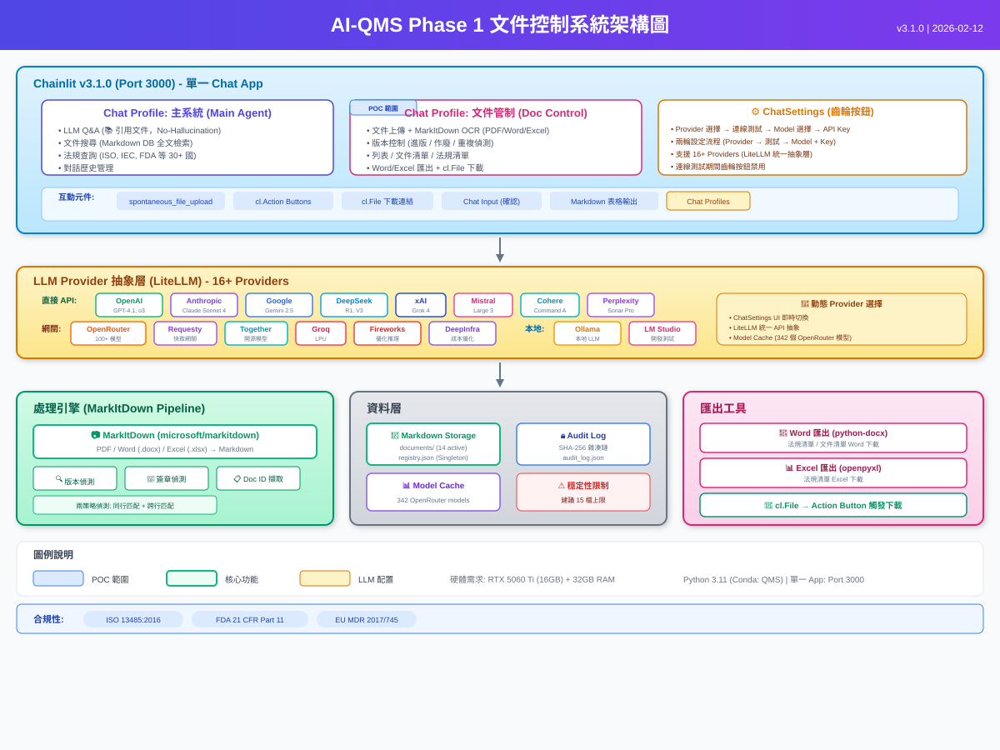

# AI-QMS: AI-Powered Quality Management System for Medical Devices

<p align="center">
  
</p>

<p align="center">
  <strong>
    <a href="#中文說明">中文</a> | 
    <a href="#english">English</a> | 
    <a href="#日本語">日本語</a>
  </strong>
</p>

---

# 中文說明

## 專案簡介

**AI-QMS** 是一套依據 **ISO 13485 醫療器材品質管理系統**標準需求所開發的 AI 智慧品質管理系統。本系統考量醫療器材 QMS 的實際運作需求，運用 AI Agent 架構實現文件管制、稽核追蹤、版本控制等核心品質管理功能的智慧化與自動化。

系統採用**主 Agent + 子 Agent** 架構設計，由主 Agent 統籌品質管理系統各模組，文件管制子 Agent 負責文件的上傳、OCR 辨識、版本偵測、簽章驗證及稽核紀錄等作業。

## 核心功能

### 主 Agent (Main Agent)
- QMS 品質管理系統智慧助手
- 自然語言對話介面，支援中/英/日多語言
- 文件搜尋、查詢、狀態監控
- 稽核紀錄查詢與匯出 (Word/Excel)
- LLM 連線測試與提供商切換
- 子系統導航與調度

### 文件管制子 Agent (Document Control Sub-Agent)
- **文件上傳與 OCR 處理** — 支援 PDF、Word、Excel、PowerPoint、圖片等格式
- **MarkItDown-First OCR 引擎** — 本地處理 ~1 秒/檔案，零 Token 消耗；掃描文件自動切換 LLM Vision 備援
- **智慧版本偵測** — 自動識別新文件 vs 版本更新，OCR 掃描文件內版本號
- **多語言簽章/印章偵測** — 支援 15+ 語言、200+ 關鍵字自動偵測簽章狀態
- **防竄改稽核紀錄** — SHA-256 雜湊鏈，完整記錄所有文件操作
- **文件作廢管理** — 透過 AI 對話作廢文件，保留稽核追蹤
- **交叉引用偵測** — 版本更新後自動搜尋引用該文件的關聯文件
- **Markdown 儲存層** — 轉換文件為 Markdown 格式，供跨 Agent 資料提取
- **原始檔案下載** — 透過 AI 對話指令下載原始文件

## 系統架構

```
┌─────────────────────────────────────────────────────┐
│                  Chainlit UI (Port 3000)             │
│  ┌─────────────────────┐ ┌────────────────────────┐  │
│  │  Profile: 主系統     │ │  Profile: 文件管制      │  │
│  │  Main Agent         │ │  Doc Control Sub-Agent  │  │
│  └─────────────────────┘ └────────────────────────┘  │
│  [ChatSettings: Provider | Model | API Key]          │
└──────────────────────┬──────────────────────────────┘
                       │
┌──────────────────────┴──────────────────────────────┐
│          LLM Provider 抽象層 (LiteLLM)               │
│  [OpenAI] [Anthropic] [Google] [Ollama] + 12 more   │
└──────────────────────┬──────────────────────────────┘
                       │
┌──────────────────────┴──────────────────────────────┐
│           Agent 編排引擎 (LangGraph)                  │
│  Main Agent ──→ Document Control Sub-Agent           │
└──────────────────────┬──────────────────────────────┘
                       │
┌──────────────────────┴──────────────────────────────┐
│              OCR 處理層                               │
│  [MarkItDown (主)] ──→ [LLM Vision (備援)]            │
└──────────────────────┬──────────────────────────────┘
                       │
┌──────────────────────┴──────────────────────────────┐
│                   資料層                              │
│  [JSON DB] [Markdown Storage] [Audit Log]            │
└─────────────────────────────────────────────────────┘
```

## 支援的 LLM 提供商 (16 家)

| 類型 | 提供商 |
|------|--------|
| **雲端 API** | OpenAI, Anthropic, Google, DeepSeek, xAI (Grok), Mistral, Cohere, Perplexity |
| **閘道平台** | OpenRouter, Groq, Together AI, Fireworks AI, Deep Infra, Requesty |
| **本地部署** | Ollama, LM Studio |

## 支援的檔案格式

| 類別 | 格式 | 處理方式 |
|------|------|----------|
| **PDF** | `.pdf` | MarkItDown (主) + LLM Vision (備援) |
| **圖片** | `.png`, `.jpg`, `.jpeg`, `.gif`, `.webp`, `.tiff`, `.bmp` | MarkItDown (主) + LLM Vision (備援) |
| **Word** | `.docx`, `.doc` | python-docx / pywin32 |
| **Excel** | `.xlsx`, `.xls` | openpyxl / pywin32 |
| **PowerPoint** | `.pptx`, `.ppt` | python-pptx / pywin32 |
| **文字** | `.txt`, `.md`, `.csv`, `.rtf` | 直接讀取 |

## 下載與安裝

### 方法一：使用 Git Clone (推薦)

```bash
git clone https://github.com/TMBIA-Tmti/AI-QMS.git
cd AI-QMS
```

### 方法二：下載 ZIP

1. 點擊本頁面右上方綠色 **「Code」** 按鈕
2. 選擇 **「Download ZIP」**
3. 解壓縮至任意目錄

## 快速開始

### 1. 建立 Conda 環境

```bash
conda create --name QMS python=3.11 --yes
conda activate QMS
```

### 2. 安裝相依套件

```bash
pip install -r requirements.txt
```

### 3. 設定環境變數

```powershell
# 使用 Ollama (本地)
$env:LLM_PROVIDER = "ollama"
$env:OLLAMA_BASE_URL = "http://localhost:11434"

# 或使用 OpenAI
$env:LLM_PROVIDER = "openai"
$env:OPENAI_API_KEY = "your-api-key"
```

### 4. 啟動系統

```bash
# 方式一：雙擊啟動 (推薦)
start.bat

# 方式二：直接啟動 Chainlit
start_chainlit.bat
```

瀏覽器將自動開啟 http://localhost:3000

## 對話指令

| 指令 | 說明 |
|------|------|
| `幫助` / `help` | 顯示使用指南 |
| `狀態` / `status` | 顯示系統狀態 |
| `列表` / `list` | 列出所有文件 |
| `搜尋 <關鍵字>` / `search <keyword>` | 搜尋文件 |
| `作廢 <文件編號> <原因>` | 作廢文件 |
| `稽核紀錄` / `audit` | 查看稽核紀錄 |
| `下載稽核紀錄 word` | 匯出稽核紀錄為 .docx |
| `下載稽核紀錄 excel` | 匯出稽核紀錄為 .xlsx |
| `連線測試` / `connection test` | 測試 LLM 連線 |

## 技術堆疊

| 類別 | 技術 |
|------|------|
| 程式語言 | Python 3.11 |
| UI 框架 | Chainlit 2.9.6 |
| Agent 框架 | LangGraph |
| LLM 抽象層 | LiteLLM |
| OCR 引擎 | MarkItDown + LLM Vision |
| 本地 LLM | Ollama |

---

# English

## Project Overview

**AI-QMS** is an AI-powered Quality Management System developed based on the requirements of **ISO 13485 Medical Device Quality Management System**. The system is designed to address the practical operational needs of medical device QMS, leveraging AI Agent architecture to automate and intelligently manage core quality functions including document control, audit trails, and version management.

The system adopts a **Main Agent + Sub-Agent** architecture, where the Main Agent orchestrates all QMS modules, and the Document Control Sub-Agent handles document upload, OCR processing, version detection, signature verification, and audit logging.

## Core Features

### Main Agent
- Intelligent QMS assistant with natural language interface
- Multilingual support (Chinese / English / Japanese)
- Document search, query, and system status monitoring
- Audit log query and export (Word/Excel)
- LLM connection testing and provider switching
- Sub-system navigation and orchestration

### Document Control Sub-Agent
- **Document Upload & OCR** — Supports PDF, Word, Excel, PowerPoint, images
- **MarkItDown-First OCR Engine** — Local processing ~1s/file, zero token cost; auto-fallback to LLM Vision for scanned documents
- **Intelligent Version Detection** — Auto-detect new document vs. version update, OCR-based version number scanning
- **Multilingual Signature/Stamp Detection** — 15+ languages, 200+ keywords for automatic signature status detection
- **Tamper-Proof Audit Trail** — SHA-256 hash chain recording all document operations
- **Document Obsolescence** — Obsolete documents via AI chat with full audit trail preservation
- **Cross-Reference Detection** — Auto-search for related documents after version updates
- **Markdown Storage Layer** — Convert documents to Markdown for cross-agent data extraction
- **Original File Download** — Download original files via AI chat commands

## System Architecture

```
┌─────────────────────────────────────────────────────┐
│                  Chainlit UI (Port 3000)             │
│  ┌─────────────────────┐ ┌────────────────────────┐  │
│  │  Profile: Main Agent│ │  Profile: Doc Control   │  │
│  │  QMS Assistant      │ │  Document Management    │  │
│  └─────────────────────┘ └────────────────────────┘  │
│  [ChatSettings: Provider | Model | API Key]          │
└──────────────────────┬──────────────────────────────┘
                       │
┌──────────────────────┴──────────────────────────────┐
│        LLM Provider Abstraction (LiteLLM)            │
│  [OpenAI] [Anthropic] [Google] [Ollama] + 12 more   │
└──────────────────────┬──────────────────────────────┘
                       │
┌──────────────────────┴──────────────────────────────┐
│          Agent Orchestration (LangGraph)              │
│  Main Agent ──→ Document Control Sub-Agent           │
└──────────────────────┬──────────────────────────────┘
                       │
┌──────────────────────┴──────────────────────────────┐
│              OCR Processing Layer                     │
│  [MarkItDown (Primary)] ──→ [LLM Vision (Fallback)] │
└──────────────────────┬──────────────────────────────┘
                       │
┌──────────────────────┴──────────────────────────────┐
│                    Data Layer                         │
│  [JSON DB] [Markdown Storage] [Audit Log]            │
└─────────────────────────────────────────────────────┘
```

## Supported LLM Providers (16)

| Type | Providers |
|------|-----------|
| **Cloud API** | OpenAI, Anthropic, Google, DeepSeek, xAI (Grok), Mistral, Cohere, Perplexity |
| **Gateway** | OpenRouter, Groq, Together AI, Fireworks AI, Deep Infra, Requesty |
| **Local** | Ollama, LM Studio |

## Supported File Formats

| Category | Formats | Processing |
|----------|---------|------------|
| **PDF** | `.pdf` | MarkItDown (Primary) + LLM Vision (Fallback) |
| **Images** | `.png`, `.jpg`, `.jpeg`, `.gif`, `.webp`, `.tiff`, `.bmp` | MarkItDown + LLM Vision |
| **Word** | `.docx`, `.doc` | python-docx / pywin32 |
| **Excel** | `.xlsx`, `.xls` | openpyxl / pywin32 |
| **PowerPoint** | `.pptx`, `.ppt` | python-pptx / pywin32 |
| **Text** | `.txt`, `.md`, `.csv`, `.rtf` | Direct read |

## Download & Install

### Option 1: Git Clone (Recommended)

```bash
git clone https://github.com/TMBIA-Tmti/AI-QMS.git
cd AI-QMS
```

### Option 2: Download ZIP

1. Click the green **"Code"** button at the top of this page
2. Select **"Download ZIP"**
3. Extract to any directory

## Quick Start

### 1. Create Conda Environment

```bash
conda create --name QMS python=3.11 --yes
conda activate QMS
```

### 2. Install Dependencies

```bash
pip install -r requirements.txt
```

### 3. Configure Environment Variables

```powershell
# Using Ollama (Local)
$env:LLM_PROVIDER = "ollama"
$env:OLLAMA_BASE_URL = "http://localhost:11434"

# Or using OpenAI
$env:LLM_PROVIDER = "openai"
$env:OPENAI_API_KEY = "your-api-key"
```

### 4. Launch System

```bash
# Option 1: Double-click to launch (Recommended)
start.bat

# Option 2: Launch Chainlit directly
start_chainlit.bat
```

Browser will automatically open http://localhost:3000

## Chat Commands

| Command | Description |
|---------|-------------|
| `help` | Show usage guide |
| `status` | Show system status |
| `list` | List all documents |
| `search <keyword>` | Search documents |
| `obsolete <doc_id> <reason>` | Obsolete a document |
| `audit` | Show audit trail |
| `download audit word` | Export audit log as .docx |
| `download audit excel` | Export audit log as .xlsx |
| `connection test` | Test LLM connection |

## Tech Stack

| Category | Technology |
|----------|------------|
| Language | Python 3.11 |
| UI Framework | Chainlit 2.9.6 |
| Agent Framework | LangGraph |
| LLM Abstraction | LiteLLM |
| OCR Engine | MarkItDown + LLM Vision |
| Local LLM | Ollama |

---

# 日本語

## プロジェクト概要

**AI-QMS** は、**ISO 13485 医療機器品質マネジメントシステム**の要求事項に基づいて開発された AI 搭載品質管理システムです。医療機器 QMS の実際の運用ニーズを考慮し、AI Agent アーキテクチャを活用して、文書管理、監査証跡、バージョン管理などのコア品質管理機能のインテリジェント化と自動化を実現しています。

本システムは**メイン Agent + サブ Agent** アーキテクチャを採用しており、メイン Agent が品質管理システム全体のモジュールを統括し、文書管理サブ Agent が文書のアップロード、OCR 処理、バージョン検出、署名検証、監査ログなどの業務を担当します。

## コア機能

### メイン Agent (Main Agent)
- QMS インテリジェントアシスタント（自然言語対話インターフェース）
- 多言語対応（中国語 / 英語 / 日本語）
- 文書検索、照会、システム状態監視
- 監査ログの照会とエクスポート（Word/Excel）
- LLM 接続テストとプロバイダー切替
- サブシステムナビゲーションとオーケストレーション

### 文書管理サブ Agent (Document Control Sub-Agent)
- **文書アップロードと OCR 処理** — PDF、Word、Excel、PowerPoint、画像に対応
- **MarkItDown-First OCR エンジン** — ローカル処理 約1秒/ファイル、トークン消費ゼロ；スキャン文書は自動的に LLM Vision にフォールバック
- **インテリジェントバージョン検出** — 新規文書 vs バージョン更新を自動識別、OCR によるバージョン番号スキャン
- **多言語署名・印鑑検出** — 15以上の言語、200以上のキーワードによる署名状態の自動検出
- **改ざん防止監査証跡** — SHA-256 ハッシュチェーンによる全文書操作の記録
- **文書廃止管理** — AI チャットによる文書廃止、監査証跡の完全保持
- **相互参照検出** — バージョン更新後に関連文書を自動検索
- **Markdown ストレージ層** — 文書を Markdown 形式に変換し、Agent 間データ抽出に活用
- **原本ファイルダウンロード** — AI チャットコマンドによる原本ファイルのダウンロード

## システムアーキテクチャ

```
┌─────────────────────────────────────────────────────┐
│                  Chainlit UI (Port 3000)             │
│  ┌─────────────────────┐ ┌────────────────────────┐  │
│  │  メイン Agent        │ │  文書管理サブ Agent      │  │
│  │  QMS アシスタント    │ │  Document Control       │  │
│  └─────────────────────┘ └────────────────────────┘  │
│  [ChatSettings: プロバイダー | モデル | API Key]       │
└──────────────────────┬──────────────────────────────┘
                       │
┌──────────────────────┴──────────────────────────────┐
│        LLM プロバイダー抽象層 (LiteLLM)               │
│  [OpenAI] [Anthropic] [Google] [Ollama] + 12 more   │
└──────────────────────┬──────────────────────────────┘
                       │
┌──────────────────────┴──────────────────────────────┐
│         Agent オーケストレーション (LangGraph)         │
│  Main Agent ──→ Document Control Sub-Agent           │
└──────────────────────┬──────────────────────────────┘
                       │
┌──────────────────────┴──────────────────────────────┐
│                OCR 処理層                             │
│  [MarkItDown (主)] ──→ [LLM Vision (フォールバック)]   │
└──────────────────────┬──────────────────────────────┘
                       │
┌──────────────────────┴──────────────────────────────┐
│                  データ層                             │
│  [JSON DB] [Markdown Storage] [Audit Log]            │
└─────────────────────────────────────────────────────┘
```

## 対応 LLM プロバイダー (16社)

| タイプ | プロバイダー |
|--------|-------------|
| **クラウド API** | OpenAI, Anthropic, Google, DeepSeek, xAI (Grok), Mistral, Cohere, Perplexity |
| **ゲートウェイ** | OpenRouter, Groq, Together AI, Fireworks AI, Deep Infra, Requesty |
| **ローカル** | Ollama, LM Studio |

## 対応ファイル形式

| カテゴリ | 形式 | 処理方法 |
|----------|------|----------|
| **PDF** | `.pdf` | MarkItDown (主) + LLM Vision (フォールバック) |
| **画像** | `.png`, `.jpg`, `.jpeg`, `.gif`, `.webp`, `.tiff`, `.bmp` | MarkItDown + LLM Vision |
| **Word** | `.docx`, `.doc` | python-docx / pywin32 |
| **Excel** | `.xlsx`, `.xls` | openpyxl / pywin32 |
| **PowerPoint** | `.pptx`, `.ppt` | python-pptx / pywin32 |
| **テキスト** | `.txt`, `.md`, `.csv`, `.rtf` | 直接読取 |

## ダウンロードとインストール

### 方法1：Git Clone（推奨）

```bash
git clone https://github.com/TMBIA-Tmti/AI-QMS.git
cd AI-QMS
```

### 方法2：ZIP ダウンロード

1. このページ上部の緑色の **「Code」** ボタンをクリック
2. **「Download ZIP」** を選択
3. 任意のディレクトリに解凍

## クイックスタート

### 1. Conda 環境の作成

```bash
conda create --name QMS python=3.11 --yes
conda activate QMS
```

### 2. 依存パッケージのインストール

```bash
pip install -r requirements.txt
```

### 3. 環境変数の設定

```powershell
# Ollama（ローカル）を使用
$env:LLM_PROVIDER = "ollama"
$env:OLLAMA_BASE_URL = "http://localhost:11434"

# または OpenAI を使用
$env:LLM_PROVIDER = "openai"
$env:OPENAI_API_KEY = "your-api-key"
```

### 4. システム起動

```bash
# 方法1：ダブルクリックで起動（推奨）
start.bat

# 方法2：Chainlit を直接起動
start_chainlit.bat
```

ブラウザが自動的に http://localhost:3000 を開きます。

## チャットコマンド

| コマンド | 説明 |
|----------|------|
| `help` / `幫助` | 使用ガイドを表示 |
| `status` / `狀態` | システム状態を表示 |
| `list` / `列表` | 全文書を一覧表示 |
| `search <キーワード>` | 文書を検索 |
| `obsolete <文書ID> <理由>` | 文書を廃止 |
| `audit` / `稽核紀錄` | 監査証跡を表示 |
| `download audit word` | 監査ログを .docx でエクスポート |
| `download audit excel` | 監査ログを .xlsx でエクスポート |
| `connection test` | LLM 接続テスト |

## 技術スタック

| カテゴリ | 技術 |
|----------|------|
| プログラミング言語 | Python 3.11 |
| UI フレームワーク | Chainlit 2.9.6 |
| Agent フレームワーク | LangGraph |
| LLM 抽象層 | LiteLLM |
| OCR エンジン | MarkItDown + LLM Vision |
| ローカル LLM | Ollama |

---

## Directory Structure / 目錄結構 / ディレクトリ構成

```
AI-QMS/
├── README.md                    # This file (中文/English/日本語)
├── requirements.txt             # Python dependencies
├── start.bat                    # Main launcher / 主啟動腳本
├── start_chainlit.bat           # Chainlit direct launcher
├── chainlit.md                  # Chainlit welcome message
├── .gitignore
├── .chainlit/                   # Chainlit configuration
│   └── config.toml
├── public/                      # Chainlit public assets
│   ├── main_agent.svg
│   └── doc_control.svg
├── src/                         # Source code
│   ├── chainlit_app/            # Chainlit application
│   │   ├── app.py               # Main app entry point
│   │   └── handlers/
│   ├── agents/                  # Agent modules
│   │   └── tools/               # LangGraph tools
│   ├── workflows/               # LangGraph workflows
│   ├── ocr/                     # OCR processing
│   │   └── vision_ocr.py        # MarkItDown + Vision OCR
│   ├── database/                # Database modules
│   │   ├── audit_log.py         # SHA-256 audit trail
│   │   └── document_store.py
│   ├── storage/                 # Markdown storage
│   │   └── markdown_storage.py
│   ├── services/
│   ├── utils/
│   │   └── audit_export.py      # Audit log Word/Excel export
│   ├── config.py
│   └── llm_providers.py         # 16 LLM provider manager
├── docs/
│   ├── CONDA_SETUP.md           # Conda environment setup
│   └── diagrams/                # Architecture diagrams (SVG/PNG)
├── data/                        # Runtime data (auto-generated)
├── uploads/                     # File upload staging
└── markdown_storage/            # Converted Markdown documents
```

## License / 授權 / ライセンス

MIT License

Copyright (c) 2026 AI-QMS Project

Permission is hereby granted, free of charge, to any person obtaining a copy
of this software and associated documentation files (the "Software"), to deal
in the Software without restriction, including without limitation the rights
to use, copy, modify, merge, publish, distribute, sublicense, and/or sell
copies of the Software, and to permit persons to whom the Software is
furnished to do so, subject to the following conditions:

The above copyright notice and this permission notice shall be included in all
copies or substantial portions of the Software.

THE SOFTWARE IS PROVIDED "AS IS", WITHOUT WARRANTY OF ANY KIND, EXPRESS OR
IMPLIED, INCLUDING BUT NOT LIMITED TO THE WARRANTIES OF MERCHANTABILITY,
FITNESS FOR A PARTICULAR PURPOSE AND NONINFRINGEMENT. IN NO EVENT SHALL THE
AUTHORS OR COPYRIGHT HOLDERS BE LIABLE FOR ANY CLAIM, DAMAGES OR OTHER
LIABILITY, WHETHER IN AN ACTION OF CONTRACT, TORT OR OTHERWISE, ARISING FROM,
OUT OF OR IN CONNECTION WITH THE SOFTWARE OR THE USE OR OTHER DEALINGS IN THE
SOFTWARE.
